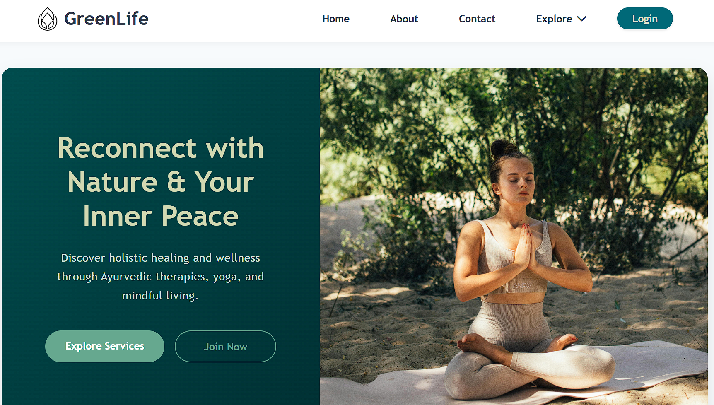

# GreenLife Wellness Center



A web-based wellness management system for a holistic health center in Colombo, Sri Lanka. Built with PHP, MySQL, HTML5, and CSS3.

---


## Overview

GreenLife Wellness Center is a full-stack web application designed to manage holistic health services. It supports three user roles — Admin, Therapist, and Client — each with a dedicated dashboard. The platform handles appointment booking, session scheduling, resource management, and client-therapist communication.

---

## Tech Stack

| Layer      | Technology                        |
|------------|-----------------------------------|
| Frontend   | HTML5, CSS3, JavaScript, Font Awesome |
| Backend    | PHP 7.4+                          |
| Database   | MySQL 8.0+                        |
| Server     | Apache / Nginx                    |

---

## Features

**Public**
- Browse services, therapist directory, and resource library
- Contact form with inquiry submission

**Client Dashboard**
- Book and manage appointments
- Track wellness progress
- Access articles, tips, and videos

**Therapist Dashboard**
- View and manage assigned clients
- Schedule and update sessions
- Respond to client inquiries

**Admin Dashboard**
- Full CRUD for users, services, therapists, and resources
- Manage articles, tips, and videos
- Oversee all appointments and inquiries

---

## Project Structure

```
GreenLife/
├── css/                  # Page-specific stylesheets
│   ├── index.css
│   ├── dashboard.css
│   ├── appointment.css
│   └── ...
├── html/                 # Static HTML pages
│   ├── index.html
│   ├── about.html
│   ├── contact.html
│   └── ...
├── php/                  # Backend scripts (auth, CRUD, dashboards)
│   ├── dbconnect.php
│   ├── login.php
│   ├── admin_dashboard.php
│   ├── client_dashboard.php
│   ├── therapist_dashboard.php
│   └── ...
├── images/               # Media assets
│   ├── services/
│   ├── articles/
│   └── videos/
└── greenlife_wellness.sql
```

---

## Getting Started

### Prerequisites

- Apache or Nginx
- PHP 7.4+
- MySQL 8.0+

### Local Development Setup

1. Clone the repository:
   ```bash
   git clone https://github.com/your-username/greenlife-wellness.git
   cd greenlife-wellness
   ```

2. Import the database (see [Database Setup](#database-setup))

3. The database connection is configured automatically:
   - Local development uses `localhost` with default credentials
   - Production (InfinityFree) uses environment-specific credentials
   - Configuration is handled in `php/config.php` (auto-generated on deployment)

4. Point your web server document root to the project directory and open it in your browser.

### Production Deployment (InfinityFree)

This project uses GitHub Actions for automatic deployment to InfinityFree hosting.

**Required GitHub Secrets:**

Set these in your repository Settings → Secrets and variables → Actions:

| Secret Name    | Description                          | Example Value                    |
|----------------|--------------------------------------|----------------------------------|
| `FTP_HOSTNAME` | InfinityFree FTP server              | `ftpupload.net`                  |
| `FTP_USERNAME` | Your FTP username                    | `epiz_XXXXXXXX`                  |
| `FTP_PASSWORD` | Your FTP password                    | `your_ftp_password`              |
| `FTP_PORT`     | FTP port (usually 21)                | `21`                             |
| `DB_HOST`      | MySQL hostname                       | `sql305.infinityfree.com`        |
| `DB_USER`      | MySQL username                       | `if0_41483792`                   |
| `DB_NAME`      | MySQL database name                  | `if0_41483792_greenlife_wellness`|
| `DB_PASS`      | MySQL password                       | `your_db_password`               |

**To Deploy:**

Simply push to the `main` branch:
```bash
git push origin main
```

The GitHub Actions workflow will automatically:
1. Create `config.php` with your database credentials
2. Deploy all files to InfinityFree via FTP
3. Your site will be live!

---

## Database Setup

Import the provided SQL dump into MySQL:

```bash
mysql -u root -p < greenlife_wellness.sql
```

Or use a GUI tool like phpMyAdmin — create a database named `greenlife_wellness` and import the file.

---

## Default Credentials

| Role      | Username    | Password |
|-----------|-------------|----------|
| Admin     | `admin`     | `123`    |
| Therapist | `therapist` | `123`    |
| Client    | `client`    | `123`    |

> Change these credentials after your first login in a production environment.

---


## Contributing

Contributions are welcome. To get started:

1. Fork the repository
2. Create a new branch:
   ```bash
   git checkout -b feature/your-feature-name
   ```
3. Make your changes and commit:
   ```bash
   git commit -m "Add: brief description of your change"
   ```
4. Push to your fork:
   ```bash
   git push origin feature/your-feature-name
   ```
5. Open a Pull Request against the `main` branch

### Guidelines

- Keep PRs focused — one feature or fix per PR
- Follow the existing code style (PHP, HTML, CSS conventions used in the project)
- Test your changes locally before submitting
- Write clear commit messages

### Reporting Issues

Found a bug or have a suggestion? Open an issue with:
- A clear title and description
- Steps to reproduce (for bugs)
- Expected vs actual behavior

---

## License

MIT © 2025 GreenLife Wellness Center  
Developed by MNSBaanu
